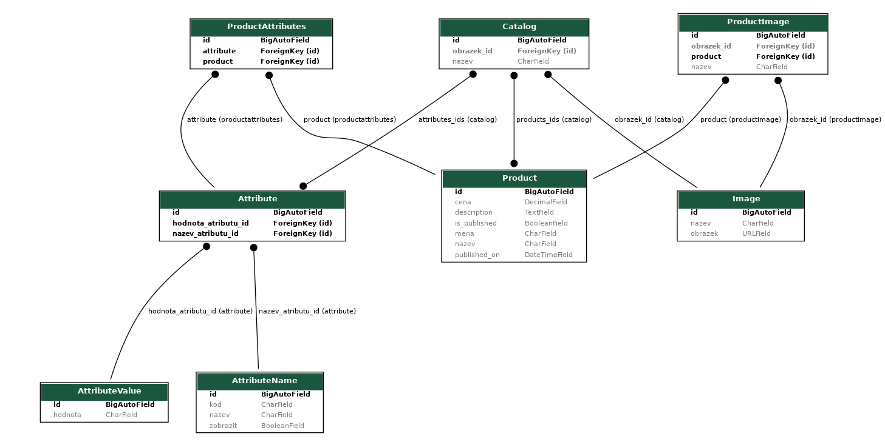

# Django assignment

## How to run

`pip install -r requirements.txt`

Run the server with `python manage.py runserver`

Development server is at [http://127.0.0.1:8000/](http://127.0.0.1:8000/)

### Requirements
Requirements can be found in file `requirements.txt`, this file was generated by `pip3 freeze > requirements.txt`

## Admin page

Username: `admin`

Password: `admin`

## Endpoints

### POST
`/import` - Takes array of JSONs or one JSON

 `{
    "AttributeName": {
      "nazev": "Barva"
    }
 }`
 
 or 
 
 `[
  {
    "AttributeName": {
      "nazev": "Barva"
    }
  },
   {
    "AttributeName": {
      "nazev": "Barva"
    }
  },
  .
  .
  .
  ]`

### GET
`/detail/<element-name>/` - query for all elements of given name

`/detail/<element-name>/<id>` - query for single element of given name, with given id

`/reset/` - deletes all tables in database. Does not reset auto increment.

## Sample requests

To be known, uploaded database is empty. (Tables are migrated and superuser is created)

`/detail/AttributeValue/`

`/detail/Attribute/`

`/detail/Catalog/`

`/detail/Attribute/2`

## Database
Project uses sqlite database.

## Data
Original assignment can be found in `test-zadani.txt`, test data can be found in `test_data.json`.

## Other notes

There is one extra script `assignment/json_check.py`

This script prints out all of the unique attributes of each element from file `test_data.json`, since checking all attributes manually is tedious and prone to mistakes.
